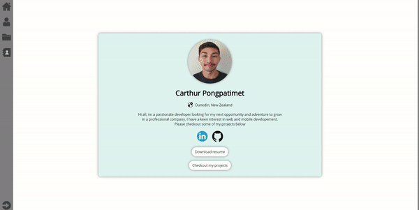

# Portfolio

**Developed by** Carthur Pongpatimet

This website is my online resume/portfolio which highlights my skills and showcases my projects. This was developed using plain HTML, CSS and Javascript.

**Check out the website by clicking the link below:**   
https://carthur-p.github.io/Portfolio/portfolio

# Technologies Used
HTML  
CSS  
Javascript  

# Things I Did
- UI/UX design
- Responsive design
- Using media query to make the site responsive for a range of devices
- Embedding Google forms with own design
- Project icon design/editing
- Unable file downloads
- Scrolling progress bar
- HTML coding
- CSS coding
- Javascript events

# Website
The website is responsive to a variety of screen sizes. It has been tested on iPad Pro, iPad, iPhone X, Samsung Note 10+, iPhone 6 and iPhone 5s screen sizes. 

## PC Screen

## Phone Screen (Samsung Note 10+)

